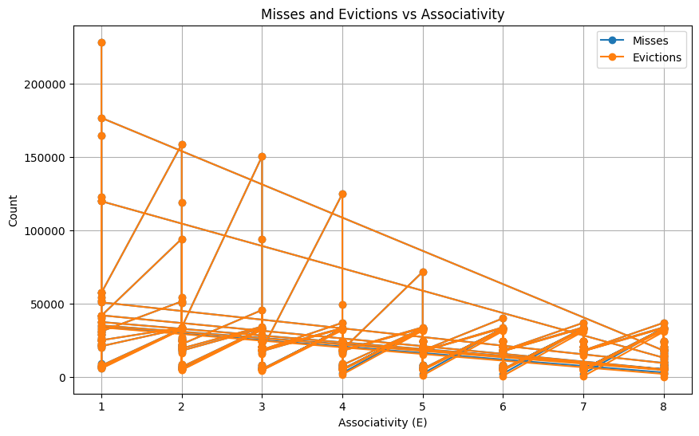
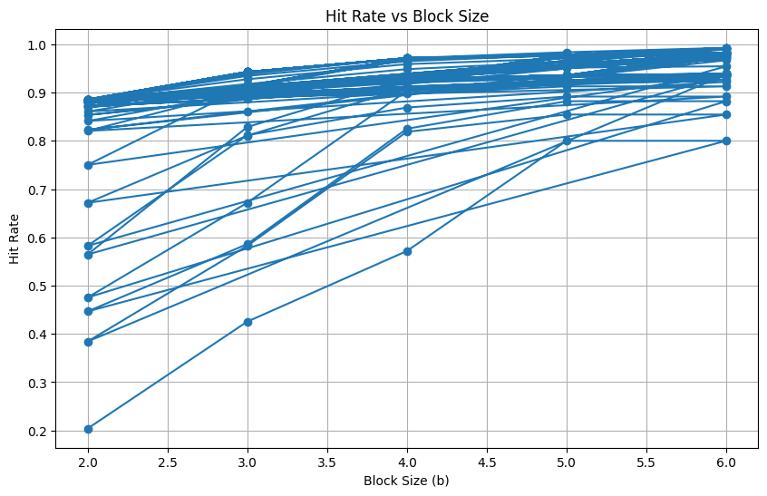

\newpage

# Design and Implementation of a Configurable Cache Simulator for Memory Hierarchy Analysis

Team members

--------------------------

--------------------------

--------------------------

--------------------------

Under:

CS Dept., GLA University

Date: 

\newpage

## 1. Abstract

Modern CPUs rely heavily on cache performance to bridge the latency gap between the processor and main memory. This project implements a trace-driven simulator written in C to mimic the behavior of a hardware cache subsystem. The goal is to analyze the effects of varying cache parameters (associativity, block size, capacity) on hit/miss rates and to explore trade-offs in memory hierarchy design.

## 2. Introduction

### Motivation

A significant performance bottleneck exists between high-speed CPU registers and slower DRAM. This is mitigated by complex SRAM cache hierarchies. Understanding cache behavior is paramount for both software optimization and hardware architecture. 
This project addresses this need by providing a tool to visualize the impact of cache configuration on memory access efficiency

### What is Cache?

A cache is a small, fast storage device that acts as a staging area for the data objects, stored in a larger, slower device. Caches are orders of magnitude faster than DRAM, and as such are very important for speeding the overall operation of CPU, without making CPU wait.

### Terminology 

**Cache Hit** : When the required data is found in the cache.

**Cache Miss** : When the required data is not found in the cache so it is requested from lower hierarchy memory.

***Cache miss are of 3 types:***

*Cold Miss* : Occurs when the cache (or a specific set) is empty. The block has never been loaded.

*Conflict Miss* : Occurs in set-associative or direct-mapped caches when the cache has sufficient capacity, but the specific set mapping to the address is full.

*Capacity Miss* : Occurs when the active working set exceeds the total size of the cache.

\newpage
## 3. System Architecture and Implementations

The simulator utilizes a modular, trace-driven architecture designed to process Valgrind memory access logs. It manages a configurable N-way Set Associative cache using a Least Recently Used (LRU) eviction policy.

### 3.1 Data Structure Design

To model the metadata required for the cache line and replacement polices, a custom data structure was defined `cache_line_t`.

```C
typedef struct {
    int valid_bit;                    // Integrity flag. (1= Active data, 0 = Empty)
    unsigned long long tag;           // Middle-order address bits for identification
    unsigned long long lru_counter;   // Timestamp for LRU eviction policy
   
} cache_line_t;
```
The system maintains a global global_lru_timestamp that increments on every memory operation, allowing the simulation to model temporal locality accurately.

### 3.2 Memory Organization and Address Mapping

The simulator dynamically allocates memory based on the user-supplied parameters S(Number of sets) and E(Associativity). Although conceptually a 2D structure(Sets X Ways), the memory is allocated as a contiguous 1D array to optimize the cache locality for the simulator itself.

For a given memory address, the simulator decomposes the 64-bit virtual address into three components:

Set Index = (Address >> b) & (S-1)

Tag = Address >> (b+s)

where:

b = log2(Block Size)

s = log2(Number of Sets)

The bitwise AND mask (S-1) ensures the index stays within bounds.

1. Tag: The unique identifier for the memory block.
2. Set Index: Determines which set the data belongs to.
3. Block offset: Ignored for the simulation logic.

The mapping from Set Index to physical memory location in the array is calculated via row-major indexing.

`Index = (SetIndex * Associativity) + WayIndex`

### 3.3 The Access Algorithm (Set-Associative Logic)

The core engine(`accessCache`) processes  memory requests using a three-stage algorithmic procedure to handle associativity and the LRU policy.

#### Phase 1 Hit detection.
The system isolates the E line corresponding to the calculated set index. it iterates through it and check for a match.

```
if line.valid_bit == 1 AND line.tag == address_tag:
    hit++
    lru_counter = global_lru_timestamp
```

#### Phase 2 Cold miss.

```
if line.valid_bit == 0:
    miss++
    line.valid_bit = 1
    line.tag = address_tag
    lru_counter = global_lru_timestamp

```


#### Phase 3 Conflict miss.

If set is full(no hit, no empty slots), a conflict miss has occured. The system must select a victim for eviction based on LRU policy.

```
min_lru = line[0].lru_counter

for each line:
   if line.lru_counter < min_lru:
       update min_lru and victim_index

```
Now that line with minimum LRU have been identified, the victim line is overwritten with the new tag, and it's lru_counter is written with global_lru_timestamp.

\newpage
## 4 Results

### 4.1 Tests


| trace               | s | E | b | hits   | misses  | evictions | hit_rate | miss_rate |
|---------------------|---|---|---|--------|---------|-----------|----------|-----------|
| traces/long.trace   | 1 | 1 | 2 | 58466  | 228498  | 228496    | 0.203740 | 0.796260  |
| traces/long.trace   | 1 | 1 | 3 | 122086 | 164878  | 164876    | 0.425440 | 0.574560  |
| traces/long.trace   | 1 | 1 | 4 | 164075 | 122889  | 122887    | 0.571762 | 0.428238  |
| traces/long.trace   | 1 | 1 | 5 | 229613 | 57351   | 57349     | 0.800146 | 0.199854  |
| traces/long.trace   | 1 | 1 | 6 | 229623 | 57341   | 57339     | 0.800181 | 0.199819  |


### Miss and eviction vs Associativity



*Fig 1: Impact of set associativity on Miss Rates.*


The sharp decline in misses and eviction as associativity increases shows the LRU policy is mitigating the conflict miss.


### Hit Rate vs Block Size


*Fig 2: Analysis of Spatial locality*

Increasing block size yields higher hit rates, confirming that the simulator correctly models the pre-fetching benefits on larger cache lines.


### The best configuration

Implict but here is verification larger cache size leads to better performance:

| trace               | s | E | b | hits   | misses  | evictions | hit_rate | miss_rate |
|---------------------|---|---|---|--------|---------|-----------|----------|-----------|
| traces/long.trace   | 8 | 8 | 6 | 284911 | 2053  | 5         | 0.992846 | 0.007154  |


## Conclusion

The trace-driven cache simulator effectively models set-associative caches with LRU eviction, capturing cold, conflict, and capacity misses with high fidelity. Results show that higher associativity drastically reduces conflict misses while larger block sizes exploit spatial locality to boost hit rates, confirming both theoretical expectations and practical behavior. By providing clear insights into cache performance and parameter trade-offs, this simulator serves as a robust platform for exploring memory hierarchies.


